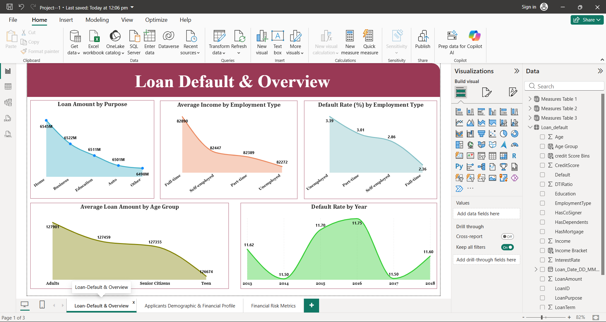
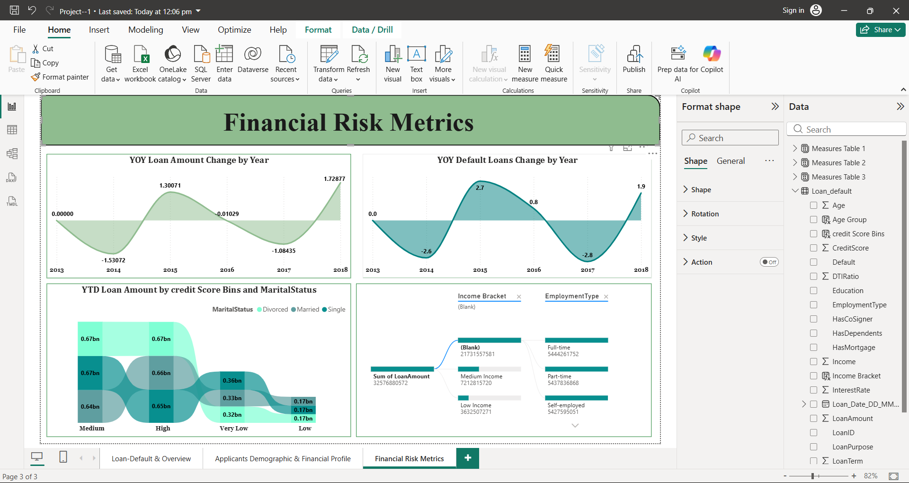

# 📊 Loan Default & Financial Risk Analysis — Power BI

> An interactive Power BI project analyzing loan defaults, borrower demographics,
> financial characteristics, and lending risk patterns.

---

## 🎯 Business Objective

The objective of this project is to analyze loan applications and identify
patterns associated with loan defaults.

The analysis focuses on:

- Loan default behavior
- Borrower demographics
- Credit score categories
- Employment characteristics
- Income and financial profile
- Loan purposes
- Year-over-year lending and default trends

The goal is to transform raw lending data into actionable insights
that could support better risk assessment and lending decisions.

---

## 🛠️ Tools & Technologies

- Power BI
- Power Query
- DAX
- Data Cleaning
- Data Modeling
- Data Visualization
- Exploratory Data Analysis

---

## 📊 Dashboard

### 1. Loan Default & Overview



This page provides an overview of loan amounts and default patterns
across loan purpose, employment type, age groups, and years.

---

### 2. Applicant Demographic & Financial Profile


This page examines borrower characteristics including:

- Age
- Credit score
- Marital status
- Employment
- Education
- Dependents
- Mortgage status

---

### 3. Financial Risk Metrics



This page focuses on financial risk indicators and year-over-year
changes in loan amounts and default loans.

---

# 🔎 Key Insights

## 1. Employment & Default Risk

[YOUR ANALYSIS HERE]

## 2. Credit Score & Loan Amount

[YOUR ANALYSIS HERE]

## 3. Age & Lending Behavior

[YOUR ANALYSIS HERE]

## 4. Year-over-Year Default Trends

[YOUR ANALYSIS HERE]

## 5. Loan Purpose

[YOUR ANALYSIS HERE]

---

# 💡 Business Recommendations

Based on the analysis:

1. [YOUR RECOMMENDATION]
2. [YOUR RECOMMENDATION]
3. [YOUR RECOMMENDATION]

---

# 🧹 Data Preparation

The dataset was prepared using Power Query.

Major preparation steps included:

- Data type validation
- Data cleaning
- Handling missing values
- Creating calculated fields
- Categorizing numerical variables
- Preparing data for visualization

---

# 🧮 Analysis

The project uses DAX measures to calculate analytical metrics
and support the dashboard visuals.

Examples include:

- Loan Amount
- Default Rate
- Average Loan Amount
- Year-over-Year Change
- Default Loan Count

---

# 📁 Repository Structure

```text
power-bi-loan-default-analysis/
│
├── Dashboard/
├── PowerBI/
├── Data/
├── Documentation/
└── README.md
